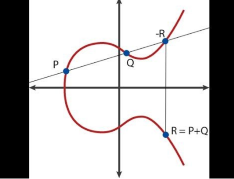

# Zero-Knowledge Proofs (ZKPs)

# Intuitive Examples of Zero-Knowledge Proofs

Zero-Knowledge Proofs (ZKPs) allow a prover to convince a verifier that a certain statement is true without revealing any information beyond the veracity of the statement itself. Here are examples to intuitively grasp the concept of ZKPs:

Actors in a Zero Knowledge Proof System

- Creator - optional, maybe combined with the prover
- Prover - I will call her Peggy
- Verifier - I will call him Victor

## Example 1: Color-Blind Verifier (Peggy and Victor)

- **Context**: Peggy wants to prove to Victor that she can distinguish between a red and a green billiard ball, despite Victor being color-blind and unable to differentiate them.

### Steps:

1. **Verification Setup**: Victor takes the two balls, one in each hand, and then hides them behind his back. He may swap the balls or leave them unchanged with a 50% chance, then presents them back to Peggy.
2. **Prover's Claim**: Peggy declares whether Victor has swapped the balls.
3. **Outcome**: Since the balls are of different colors, Peggy can always correctly state whether the balls were swapped. If the balls were identical, Peggy's chance of guessing correctly would merely be 50%.
4. **Repetition for Confidence**: To increase Victor's confidence, this process is repeated multiple times. Each successful round exponentially decreases the likelihood that Peggy is guessing, rather than truly knowing the difference.

## Example 2: Where's Wally

- **Context**: Peggy has found Wally in a complex, crowded picture and wants to prove this to Victor without revealing Wally's exact location.

### Steps:

1. **Proof of Discovery**: Peggy finds Wally and is ready to prove it to Victor without directly pointing out Wally's location, as Victor might claim the discovery as his own.
2. **Zero-Knowledge Approach**: Peggy uses a large sheet of paper with a Wally-shaped hole cut out of it.
3. **Verification**: She overlays the sheet on the picture, aligning the hole with Wally's location. Victor sees Wally through the hole but cannot discern his location in the overall picture.
4. **Outcome**: Victor is convinced Peggy has found Wally without learning the location himself, maintaining the zero-knowledge condition.

## Conclusion

These examples illustrate the essence of Zero-Knowledge Proofs: enabling one party (the prover) to prove to another party (the verifier) that they know a secret or a fact, without revealing the secret or fact itself. ZKPs are a powerful tool in cryptography, ensuring privacy and security in various protocols.

# Mathematical Foundations for Cryptography

Cryptography relies heavily on mathematical structures and concepts to ensure security and privacy. Among these, the sets of integers, rational numbers, real numbers, and the concept of fields (finite and infinite) play crucial roles. Below is an overview of these foundational elements:

## Sets

### Integers (ℤ)
The set of **Integers** is denoted by **ℤ** and includes all positive and negative whole numbers, including zero.
Example: `{…, -4, -3, -2, -1, 0, 1, 2, 3, 4, …}`

### Rational Numbers (ℚ)
The set of **Rational Numbers** is denoted by **ℚ** and consists of all numbers that can be expressed as the quotient or fraction of two integers, with a non-zero denominator.
Example: `{... , 1/3, 1/2, 2, 22/7, ...}`

### Real Numbers (ℝ)
The set of **Real Numbers** is denoted by **ℝ** and includes all the rational numbers, plus all the irrational numbers (numbers that cannot be expressed as a simple fraction).
Example: `{2, -4, 6.13, π, √2, …}`

## Fields

Fields are denoted by **F** (if they are a finite field) or **K** (for a field of real or complex numbers). They provide a framework for addition, subtraction, multiplication, and division operations, under certain conditions that ensure stability and predictability in cryptographic systems.

### Finite Fields (ℤₚ*)
A **Finite Field**, often used in cryptography, is represented as **ℤₚ***, indicating a finite field of integers modulo a prime number **p**, where each element has a multiplicative inverse. Finite fields are crucial in cryptography due to their "short", exact representations and their useful algebraic properties.

**Why Use Finite Fields in Cryptography?**
Finite fields are ideal for cryptographic applications because:
- Elements in finite fields have exact representations, making them computationally efficient to work with.
- The mathematical properties of finite fields, such as the existence of multiplicative inverses, support complex cryptographic operations like modular arithmetic, which is fundamental to many encryption and hashing algorithms.
- The finite nature of these fields ensures that operations over the elements wrap around within a predictable range, which is useful for creating cyclic groups needed in algorithms like RSA and ECC (Elliptic Curve Cryptography).

## Conclusion

Understanding these mathematical sets and fields is essential for delving into cryptography. They form the basis for designing and analyzing cryptographic algorithms that secure digital communications.

# Group Theory

Group Theory is a branch of mathematics that studies the algebraic structures known as groups. It is fundamental in various areas of mathematics and science, including cryptography, physics, and chemistry, providing a framework for understanding symmetry, operations, and their properties.

## Definition of a Group

In abstract algebra, a **group** is defined as a set equipped with an operation that combines any two elements to form a third element within the same set, satisfying four key properties: closure, associativity, identity, and invertibility. This operation can be represented in various ways, such as multiplication (`*`) or addition (`+`), depending on the group's nature.

## Closure

### Multiplicative Example
In a group `(G, *)`, for any `a, b` in `G`, the product `a * b` is also in `G`.
- **Numerical Instance**: In the group of non-zero rational numbers under multiplication, `(3/4) * (4/3) = 1`, which is also a non-zero rational number.

### Additive Example
In a group `(G, +)`, for any `a, b` in `G`, the sum `a + b` is also in `G`.
- **Numerical Instance**: In the group of integers `(ℤ, +)`, `2 + 3 = 5`, and `5` is also an integer.

## Associativity

### Multiplicative
For any `a, b, c` in `G`, `(a * b) * c = a * (b * c)`.
- **Numerical Instance**: `2 * (3 * 4) = (2 * 3) * 4 = 24`, demonstrating associativity in multiplication.

### Additive
For any `a, b, c` in `G`, `(a + b) + c = a + (b + c)`.
- **Numerical Instance**: `1 + (2 + 3) = (1 + 2) + 3 = 6`, showing associativity in addition.

## Identity

### Multiplicative
There exists an element `e` in `G` such that for every `a` in `G`, `e * a = a * e = a`.
- **Numerical Instance**: For any real number `a`, `1 * a = a * 1 = a`, where `1` is the multiplicative identity.

### Additive
There exists an element `0` in `G` such that for every `a` in `G`, `0 + a = a + 0 = a`.
- **Numerical Instance**: For any integer `a`, `0 + a = a + 0 = a`, where `0` is the additive identity.

## Invertibility

### Multiplicative
For each `a` in `G`, there exists an element `b` in `G` such that `a * b = b * a = e`.
- **Numerical Instance**: For `a = 3` (in real numbers except zero), its inverse `b = 1/3` since `3 * (1/3) = (1/3) * 3 = 1`.

### Additive
For each `a` in `G`, there exists an element `-a` in `G` such that `a + (-a) = (-a) + a = 0`.
- **Numerical Instance**: For `a = 5` (in integers), its inverse `-a = -5` since `5 + (-5) = (-5) + 5 = 0`.

## Example: ℤ under Addition

Consider the set of all integers ℤ with the operation of addition (`+`), denoted `(ℤ, +)`:
- **Closure**: `7 + 2 = 9`, and `9` is an integer.
- **Associativity**: `(3 + 4) + 5 = 3 + (4 + 5) = 12`.
- **Identity**: `4 + 0 = 0 + 4 = 4`.
- **Invertibility**: `6 + (-6) = (-6) + 6 = 0`.

## Example: Non-Zero Real Numbers under Multiplication

Consider the set of all non-zero real numbers ℝ* with the operation of multiplication (`*`), denoted `(ℝ*, *)`:
- **Closure**: `0.5 * 2 = 1`, and `1` is a non-zero real number.
- **Associativity**: `(0.5 * 2) * 4 = 0.5 * (2 * 4) = 4`.
- **Identity**: `3 * 1 = 1 * 3 = 3`.
- **Invertibility**: `4 * (1/4) = (1/4) * 4 = 1`.

## Conclusion

The operation used to define a group (whether it's addition, multiplication, or another binary operation) dictates how the group's

## Types of Groups

- **Abelian (Commutative) Group**: A group where the operation is commutative, i.e., `a * b = b * a` for all `a, b` in `G`.
- **Non-Abelian (Non-commutative) Group**: A group where the operation is not necessarily commutative.
- **Finite Group**: A group with a finite number of elements.
- **Infinite Group**: A group with an infinite number of elements.

## Example: The Set of Integers Under Addition

Consider the set of all integers `Z` with the operation of addition `+`. This set forms a group because it satisfies all group properties:

- **Closure**: The sum of any two integers is an integer.
- **Associativity**: `(a + b) + c = a + (b + c)` for any integers `a, b, c`.
- **Identity**: The number `0` serves as the identity element because `a + 0 = 0 + a = a` for any integer `a`.
- **Invertibility**: For every integer `a`, there exists an integer `-a` (the additive inverse of `a`) such that `a + (-a) = (-a) + a = 0`.

Thus, `(Z, +)` is an abelian group.

- **Cryptography**: Group theory underpins public-key cryptography schemes, including RSA and elliptic curve cryptography (ECC), by providing the mathematical structure for operations.

# Understanding Fermat's Little Theorem and Finding Multiplicative Inverses

Fermat's Little Theorem is a key principle in number theory with critical applications in the field of cryptography, particularly useful in operations such as finding multiplicative inverses in modular arithmetic.

## Fermat's Little Theorem

Fermat's Little Theorem states that if `p` is a prime number, then for any integer `a` that does not divide `p`, it holds that:

### Method 1: Extended Euclidean Algorithm

For any integers `a` and `m`, the Extended Euclidean Algorithm can find integers `x` and `y` such that `a * x + m * y = gcd(a, m)`. If `gcd(a, m) = 1`, then `x` is the multiplicative inverse of `a` modulo `m`.

### Method 2: Using Fermat's Little Theorem

If `m` is prime, Fermat's Little Theorem allows for a straightforward calculation of the multiplicative inverse of `a` modulo `m` as `a^(m-2) mod m`.

## Example: Finding an Inverse Using Fermat's Little Theorem

To find the multiplicative inverse of `3` modulo `7`:

1. Verify `7` is prime.
2. Calculate `3^(7-2) = 3^5 = 243`.
3. Find `243 mod 7 = 5`.

Therefore, `5` is the multiplicative inverse of `3` modulo `7`, satisfying the equation `3 * 5 ≡ 1 (mod 7)`.

## Conclusion

Fermat's Little Theorem and the Extended Euclidean Algorithm are powerful tools in cryptography, enabling secure operations within finite fields. Understanding these methods is essential for implementing cryptographic protocols that rely on modular arithmetic.

# Fields, Finite Fields, and Generators

This document provides an overview of fields, with a focus on finite fields and the concept of generators, which are fundamental to modern cryptography and various mathematical disciplines.

## Fields

A **field** is a set equipped with two operations, addition and multiplication, that satisfy the axioms for both a commutative group under addition and a commutative group under multiplication (excluding the additive identity). Fields allow for a comprehensive framework of arithmetic operations including addition, subtraction, multiplication, and division (except by zero).

### Properties of Fields

- **Closure**: For any two elements `a` and `b` in a field `F`, both `a + b` and `a * b` are in `F`.
- **Associativity**: Addition and multiplication are associative.
- **Commutativity**: Addition and multiplication are commutative.
- **Additive and Multiplicative Identity**: There exists an element `0` in `F` such that `a + 0 = a` for any `a` in `F`, and an element `1` in `F` such that `a * 1 = a` for any `a` in `F`.
- **Additive Inverses**: For every `a` in `F`, there exists an element `-a` in `F` such that `a + (-a) = 0`.
- **Multiplicative Inverses**: For every `a ≠ 0` in `F`, there exists an element `a^(-1)` in `F` such that `a * a^(-1) = 1`.

## Finite Fields (Galois Fields)

A **finite field**, also known as a Galois field, is a field that contains a finite number of elements. Finite fields are denoted as `GF(p^n)`, where `p` is a prime number called the characteristic of the field, and `n` is a positive integer.

### Properties of Finite Fields

- **Existence and Uniqueness**: For every prime `p` and positive integer `n`, there exists exactly one finite field (up to isomorphism) with `p^n` elements, denoted `GF(p^n)` or `F_(p^n)`.
- **Subfields**: A finite field `GF(p^n)` contains a subfield `GF(p^m)` if and only if `m` divides `n`.

## Generators in Finite Fields

In the context of a finite field, a **generator** (or **primitive element**) is an element of the field that can generate all non-zero elements of the field through its successive powers.

### Finding a Generator

To find a generator of a finite field `GF(p)`:

1. Identify a prime `p` and consider the field `GF(p)`.
2. Choose an element `g` in `GF(p)`.
3. Verify that `g` is a generator by ensuring that `g^k` produces all non-zero elements of `GF(p)` for `k = 1, 2, ..., p-1`.

### Application in Cryptography

Generators are crucial in cryptographic protocols, such as Diffie-Hellman key exchange and elliptic curve cryptography, where they are used to produce public keys and facilitate secure communications.

## Conclusion

Fields, particularly finite fields, and the concept of generators play a pivotal role in the mathematical foundation of cryptography. Understanding these concepts is essential for the design and analysis of cryptographic systems and algorithms.

# Explanation of Cyclic Groups and Generators: The Case of ℤ₅*

The statement refers to the cyclic nature of the multiplicative group modulo 5, denoted as ℤ₅*, and identifies its generators. Here's a detailed explanation:

## Understanding ℤ₅*

ℤ₅* represents the set of integers modulo 5 that are coprime to 5. Since 5 is a prime number, ℤ₅* includes all non-zero elements of ℤ₅, which are `{1, 2, 3, 4}`. This set forms a group under multiplication modulo 5.

## Cyclic Group

A group is called **cyclic** if there exists at least one element (called a **generator**) in the group such that repeated operations of this element on itself generate every element in the group.

## Generators of ℤ₅*

The statement claims ℤ₅* is cyclic with two generators: `2` and `3`. To verify this, we need to show that repeated multiplication of these numbers by themselves modulo 5 generates every non-zero element of ℤ₅*.

### Case for 2 as a Generator:

- **2¹ = 2 mod 5** = 2
- **2² = 4 mod 5** = 4
- **2³ = 8 mod 5** = 3
- **2⁴ = 16 mod 5** = 1

Starting with 2 and repeatedly multiplying by 2 then taking the result modulo 5 cycles through 2, 4, 3, and 1, which are all the elements of ℤ₅*.

### Case for 3 as a Generator:

- **3¹ = 3 mod 5** = 3
- **3² = 9 mod 5** = 4
- **3³ = 27 mod 5** = 2
- **3⁴ = 81 mod 5** = 1

Similarly, starting with 3 and repeatedly multiplying by 3 then taking the result modulo 5 cycles through 3, 4, 2, and 1, again hitting all elements of ℤ₅*.

## Conclusion

Both 2 and 3 are generators of ℤ₅* because, through their powers, they produce every element in the group. This demonstrates the cyclic nature of ℤ₅* and highlights the property that not all elements of a cyclic group are necessarily generators, but all elements can be generated by the powers of any generator of the group.

# Group Homomorphisms

Group Homomorphisms are fundamental concepts in abstract algebra that relate two groups by preserving the group operation structure. They provide a way to map elements from one group to another while maintaining the operation's "shape" or structure.

## Definition

A **group homomorphism** is a function `φ` from a group `(G, *)` to another group `(H, ·)` that respects the group operation. Formally, for all elements `a` and `b` in `G`, the following property must hold:

φ(a * b) = φ(a) · φ(b)

This means that applying the group operation to `a` and `b` before mapping is the same as mapping `a` and `b` first and then applying the group operation in `H`.

## Properties

- **Preservation of Identity**: If `e_G` is the identity element in `G`, then `φ(e_G)` will be the identity element in `H`.
- **Preservation of Inverses**: For every element `a` in `G`, `φ(a^(-1))` is the inverse of `φ(a)` in `H`.

## Types of Homomorphisms

- **Isomorphism**: A bijective (one-to-one and onto) homomorphism. If an isomorphism exists between two groups, they are considered structurally the same, or *isomorphic*.
- **Endomorphism**: A homomorphism where the domain and codomain are the same group.
- **Automorphism**: An isomorphism where the domain and codomain are the same group.

## Example

Consider the groups `(ℤ, +)` and `(ℝ⁺, *)`, where `ℤ` is the set of integers with addition, and `ℝ⁺` is the set of positive real numbers with multiplication. Define `φ: ℤ → ℝ⁺` by `φ(n) = 2^n`.

- **Preserves Operation**: For any `m, n` in `ℤ`, `φ(m + n) = 2^(m + n) = 2^m * 2^n = φ(m) * φ(n)`.
- **Preserves Identity**: The identity in `ℤ` is `0`, and `φ(0) = 2^0 = 1`, which is the identity in `ℝ⁺`.
- **Preserves Inverses**: The inverse of `n` in `ℤ` is `-n`, and `φ(-n) = 2^(-n)`, which is the multiplicative inverse of `2^n` in `ℝ⁺`.

Thus, `φ` is a group homomorphism from `(ℤ, +)` to `(ℝ⁺, *)`.

## Conclusion

Group homomorphisms are powerful tools in algebra for understanding the relationships between different algebraic structures. They allow mathematicians to transfer problems and solutions between groups, preserving the essence of group operations and enabling deeper insights into the nature of mathematical objects.

# Asymmetric vs. Symmetric Encryption

| Feature | Asymmetric Encryption | Symmetric Encryption |
|---------|-----------------------|----------------------|
| **Key Types** | Uses a pair of keys: a public key for encryption and a private key for decryption. | Uses a single shared key for both encryption and decryption. |
| **Speed** | Generally slower due to complex mathematical operations. | Faster, as it uses simpler operations. |
| **Common Algorithms** | RSA, ECC (Elliptic Curve Cryptography), DH (Diffie-Hellman). | AES (Advanced Encryption Standard), DES (Data Encryption Standard), 3DES. |
| **Data Size** | Encrypted data size can be larger than the original. | Encrypted data size is generally close to the original. |
| **Use Cases** | - Secure key exchange - Digital signatures - Encryption of small amounts of data | - Bulk data encryption - System and network encryption - File and disk encryption |
| **Security** | Based on hard mathematical problems, making it secure for key exchange. | Security depends on the secrecy of the shared key. |
| **Scalability** | Scalable for a large number of users as no need to securely distribute keys to each user. | Challenges in key distribution and management when dealing with a large number of users. |

## When to Use Which?

- **Asymmetric Encryption**: Best used for establishing secure communication channels, such as SSL/TLS for websites, where key exchange is required without a prior secure channel. It's also ideal for scenarios requiring non-repudiation, like digital signatures.

- **Symmetric Encryption**: Ideal for encrypting large volumes of data efficiently, such as database encryption, file storage, or internal system communication where speed is critical and the secure exchange of the encryption key can be managed.

# Elliptic Curves and Their Application in Blockchain

Elliptic Curve Cryptography (ECC) is a key pillar of modern cryptographic systems, including blockchain technology. ECC offers a way to secure communications, authenticate participants, and ensure the integrity of transactions on the blockchain.

## What Are Elliptic Curves?

Elliptic curves are mathematical structures defined over a finite field that follows a specific cubic equation, typically of the form:

y² = x³ + ax + b

where `a` and `b` are constants that define the curve's shape, provided that `4a³ + 27b² ≠ 0` (to avoid singularities).

## Significance in Cryptography

- **Efficiency**: ECC provides the same level of security as RSA cryptography but with much shorter keys, making operations faster and more efficient.
- **Security**: The problem of calculating the discrete logarithm on elliptic curves is much harder compared to other fields, offering stronger security per bit.
- **Scalability**: Smaller key sizes reduce processing power requirements, making ECC suitable for systems with limited computational resources, such as IoT devices and smartphones.

## Application in Blockchain

Elliptic curves are integral to several blockchain mechanisms, including:

- **Digital Signatures**: ECC is used to create and verify digital signatures in transactions, ensuring they are authorized by the transaction initiator. Bitcoin, for example, uses the Elliptic Curve Digital Signature Algorithm (ECDSA) for this purpose.
- **Key Agreement**: ECC can facilitate secure key exchanges between parties, establishing secure channels for private communications.
- **Public Key Infrastructure**: Blockchain addresses and wallets are often derived from ECC public keys, linking transactions and balances to user identities securely.

## Example: ECC in Bitcoin

Bitcoin uses the secp256k1 elliptic curve for its cryptographic operations. Here's a simplified overview of generating a Bitcoin address:

1. **Key Pair Generation**: Generate a private key `d` (a random number) and calculate the corresponding public key `P` by multiplying `d` with the curve's base point `G`:

P = dG

2. **Public Key Hashing**: Apply SHA-256 hashing to `P`, followed by RIPEMD-160 hashing.
3. **Address Encoding**: Add network bytes, calculate checksum with double SHA-256 hashing, and encode the result using Base58Check to produce the final Bitcoin address.

This process ensures that Bitcoin addresses are securely tied to users' private keys without revealing the keys themselves, enabling secure ownership and transfer of funds.

## Conclusion

Elliptic Curve Cryptography is a cornerstone of the cryptographic protocols underpinning blockchain technologies. Its advantages in security and efficiency make it an ideal choice for securing digital assets, authenticating transactions, and ensuring the integrity of blockchain networks.

# Understanding Polynomials

Polynomials are mathematical expressions involving a sum of powers in one or more variables multiplied by coefficients. This document explores fundamental operations with polynomials, their roots, concepts such as the Schwartz-Zippel Lemma, criteria for polynomial equality, Lagrange interpolation, and representations.

## Polynomial Operations

### Adding Polynomials

To add polynomials, combine like terms (terms with the same variable and exponent). 

**Example:**

(3x² + 2x + 1) + (2x² - 3x + 5) = 5x² - x + 6

### Multiplying Polynomials

Multiply each term in the first polynomial by each term in the second polynomial, and then combine like terms.

**Example:**

(x + 2)(x - 3) = x² - 3x + 2x - 6 = x² - x - 6

### Dividing Polynomials

Polynomial division can be performed similarly to long division. The division of polynomials may result in a quotient and a remainder.

**Example:**

Divide x² + 3x + 2 by x + 2.

Result: x + 1 (Quotient), Remainder: 0

## Roots of a Polynomial

The roots (or zeros) of a polynomial are the values of the variable that make the polynomial equal to zero.

**Example:**

For the polynomial `x² - x - 2`, the roots can be found by factoring: `(x - 2)(x + 1) = 0`. Thus, the roots are `x = 2` and `x = -1`.

## Schwartz-Zippel Lemma

The Schwartz-Zippel Lemma is a probabilistic method to test if a polynomial is identically zero over a finite field or domain. It states that if a polynomial is not identically zero, the probability that it evaluates to zero at a randomly chosen point is less than the degree of the polynomial divided by the size of the domain.

## Equality of Two Polynomials

Two polynomials are equal if they have the same degree and corresponding coefficients are equal. This implies that their difference is the zero polynomial.

## Lagrange Interpolation

Lagrange Interpolation is a method to reconstruct a polynomial given a set of points. For `n+1` points, there exists a unique polynomial of degree at most `n` that passes through all the points.

**Example:**

Given points `(1,2)`, `(2,4)`, and `(3,6)`, the Lagrange polynomial is `L(x) = 2x`.

## Representations of Polynomials

- **Standard Form**: Written as a sum of terms ordered by degree, from highest to lowest.
- **Factored Form**: Expressed as a product of its factors.
- **Root Form**: Expressed in terms of its roots.

**Example:**

Standard Form: `x² - 3x + 2`

Factored Form: `(x - 1)(x - 2)`

Root Form: `x = 1, x = 2`

## Conclusion

Polynomials play a crucial role in various fields of mathematics and science. Understanding their operations, roots, and properties such as the Schwartz-Zippel Lemma and Lagrange Interpolation provides a solid foundation for further study and application in algebra, calculus, and beyond.

